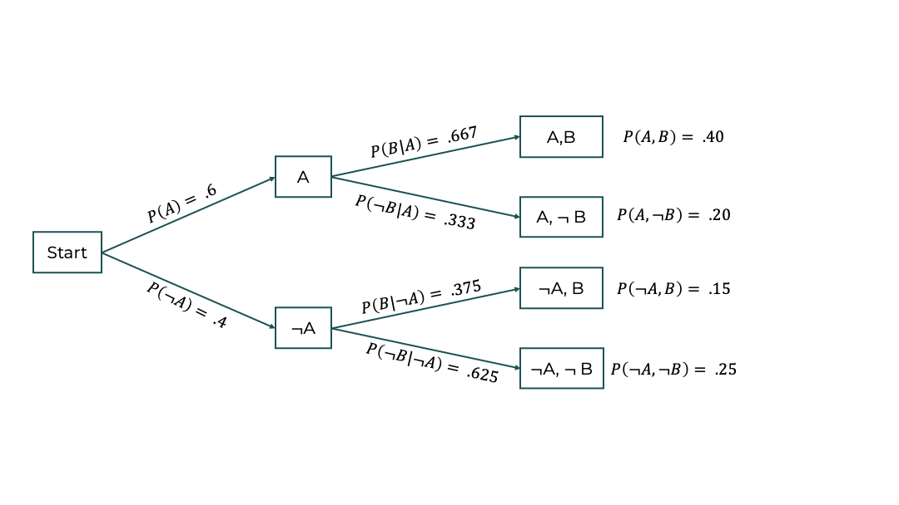
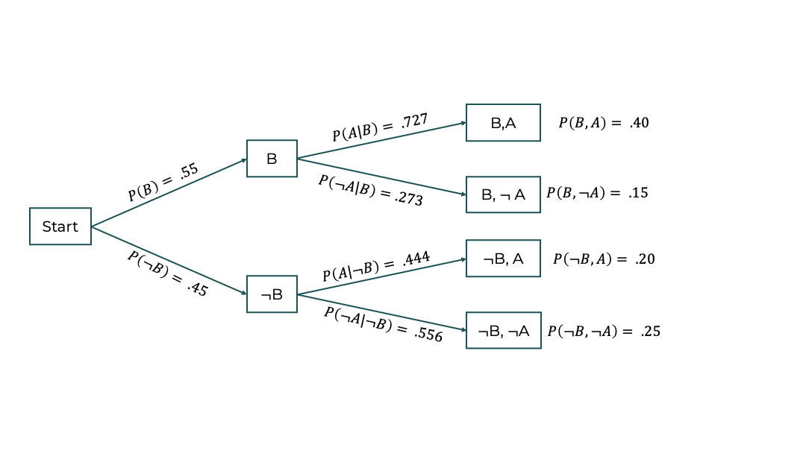
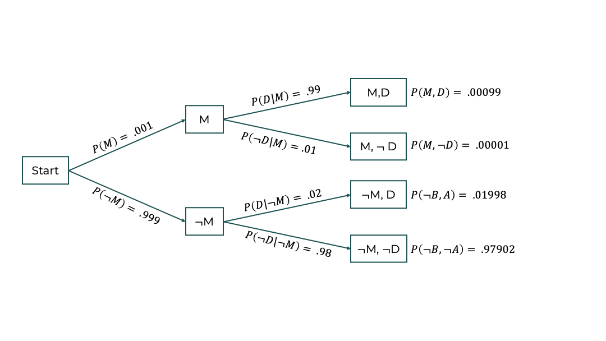

```{r xaringan-themer, include=FALSE, warning=FALSE}
library(xaringanthemer)
style_mono_accent(
  base_color = "#1c5253",
  header_font_google = google_font("Josefin Sans"),
  text_font_google   = google_font("Montserrat", "300", "300i"),
  code_font_google   = google_font("Fira Mono")
)
```

# Title Slide

Welcome to Week 1!

---

# What is Bayesian Analysis?

- A framework for reasoning with uncertainty.
- Combines prior beliefs and observed data.

---

1. **Prior**: Initial beliefs.
2. **Likelihood**: Connects data to the model.
3. **Posterior**: Updated beliefs after data.

---

# Probability 

For today, we'll build a foundation by reviewing probability (covered in PSY 611 -- remember?) and connecting these ideas to Bayesian frameworks for calculating and thinking about probability. 

I'll draw on an article, [Introduction to Bayesian Inference](../readings/Etz and Vandekerckhove - 2018 - Introduction to Bayesian Inference for Psychology.pdf) by Alex Etz and Joachim Vandekerckove (2018, _Psychon Bull Review_).

---

## Interpretation

- **Epistemic:** probability is the _degree of belief_.
  - A number between 0 and 1 that quantifies how strongly we think something is true based on relevant information. 
  - There is no such thing as _the_ probability. There is only _your_ probability.
  - BUT probability is not _arbitrary_.
  
- **Aleatory:** probability is a statement of the expected frequency over many repetitions of a procedure.
  - Cannot speak to singular events. 
  - Assumes independence among repetitions.
  - Can be a valid conceptual interpretation but is rarely ever an operational one.

In the vast majority of cases, psychologists are trying to make statements about singular events:
- _this_ theory is true or not.
- _this_ effect is positive or negative.
- _this_ model or _that_ model is more likely.

---

## Notation

- $P(A)$ is the probability of event A.
- $P(A, B)$ is the probability that both A and B happen.
- $P(B|A)$ is the probability of event B given that A is true. 

---

# Product Rule: Basics

- **Formula**:
  
  $$
  P(A, B) = P(A)P(B|A) = P(B)P(A|B)
  $$

- **Meaning**:
  - The probability of $(A)$ and $(B)$ occurring together -- $P(A, B)$ -- can be calculated using:
    - $P(A)$: Probability of $(A)$.
    - $P(B|A)$: Probability of $(B)$ given $(A)$, or vice versa.

---

# Product Rule: Example

- **Scenario**:
  - Toss a coin twice.
  - $(A)$: First toss is heads.
  - $(B)$: Second toss is heads.

- **Given**:
  - $P(A) = 0.5$ (fair coin).
  - $P(B|A) = 0.5$ (independent tosses).

- **Using the product rule**:
  $$
  P(A, B) = P(A)P(B|A) = 0.5 \times 0.5 = 0.25
  $$

---

# Product Rule: Intuition

- The joint probability -- $P(A, B)$ -- reflects:
  - The likelihood of one event.
  - Adjusted by how the second event depends on the first.

- **For Independent Events**:
  $$
  P(A, B) = P(A)P(B)
  $$

- **For Dependent Events**:
  $$
  P(A, B) = P(A)P(B|A)
  $$

---

Let's say A is the event that it rains today and B is the event that it rains tomorrow. There's a 60% chance it will rain today. If it does rain today, it'll probably rain tomorrow (let's say 2/3 chance). But if it doesn't rain today, it probably won't rain tomorrow (p = .625).

- $P(A) = .6$
- $P(B|A) = .667$
- $P(\neg B|\neg A) = .625$

---



The probability of the joint events are found by multiplying the values along a path. 

---

# Sum Rule: Basics

- **Formula**:
  $$
  P(A) = P(A, B) + P(A, \neg B)
  $$

- **Meaning**:
  - The probability of $(A)$ happening is the sum of:
      - $P(A, B)$: Probability of $(A)$ and $(B)$ both happening.
      - $P(A, \neg B)$: Probability of $(A)$ happening without $(B)$.

- **Disjoint set**:
  - A collection of mutually exclusive events. 
---

# Sum Rule: Example

- **Scenario**:
  - Drawing a card from a deck.
  - $(A)$: The card is red.
  - $(B)$: The card is a heart.
  - $(\neg B)$: The card is a diamond.

- **Using the Sum Rule**:
  $$
  P(A) = P(A, B) + P(A, \neg B)
  $$

- **Given**:
  - $P(A, B) = \frac{13}{52}$ (hearts).
  - $P(A, \neg B) = \frac{13}{52}$ (diamonds).

- **Result**:
  $$
  P(A) = \frac{13}{52} + \frac{13}{52} = 0.5
  $$

---

# Sum Rule: Intuition

- The sum rule finds **total probability** by accounting for all disjoint ways $(A)$ can occur.

- **General Formula**:
  $$
  P(A) = \sum_{i} P(A, B_i)
  $$

- Ensures that no possibilities are overlooked.

---

## Exercise


Construct the equivalent path diagram starting on the left with a fork that depends on event B, instead of event A.

---

## Exercise: Solution



---

# Bayesian inference

Bayesian inference is the application of the product and sum rules to real problems of inference. 

- Consider $H$ to be a hypothesis and $\neg H$ to be the competing hypothesis.
- Before any data are collected, the research has some belief in these hypotheses. These are priors or **prior probabilities**, $P(H)$ and $P(\neg H)$.
- These hypotheses are well-defined if they make a specific prediction about each experimental outcome (D) through a _likelihood function_ like $P(D|H)$ and $P(D|\neg H)$.
  - Likelihoods are how strongly data (D) are implied by a hypothesis. 
  - Think NHST: $P(D|H_0)$.
  
---

## Bayes' Rule

The Product Rule states that
$$
P(H, D) = P(D)P(H|D)
$$
therefore:
$$
P(H|D) = \frac{P(H, D)}{P(D)}
$$
In addition, 
$$
P(H, D) = P(H)P(D|H)
$$
so we can replace the numerator:
$$
P(H|D) = \frac{P(H)P(D|H)}{P(D)}
$$

This is Bayes' Rule!

$P(H|D)$ and $P(\neg H|D)$ are _posterior probabilities_.

---

## Prior predictive probability $P(D)$

How do we calculate this probability? We use the Sum Rule.

$$
P(D)  = P(D, H) + P(D, \neg H) \\
      = P(H)P(D|H) + P(\neg H)P(D|\neg H)
$$
Now, we can rewrite Bayes' Rule using only prior probabilities and likelihoods.

$$
P(H|D) = \frac{P(H)P(D|H)}{P(H)P(D|H) + P(\neg H)P(D|\neg H)}
$$
And we can express our posterior in any case with K competing and mutually-exclusive hypotheses.

$$
P(H|D) = \frac{P(H)P(D|H)}{\sum_{k = 1}^K P(H_k)P(D|H_k)}
$$
---

## Bayes' Rule Terminology

- **prior probabilities:** $P(H)$ and $P(\neg H)$
  - Probability prior to seeing data.
- **likelihood functions:** $P(D|H)$ and $P(D|\neg H)$
  - function showing how likely an outcome/data are given a specific hypothesis.
- **posterior probabilities:**: $P(H|D)$ and $P(\neg H|D)$
  - probability of a hypothesis given data. A combination of prior probabilities and likelihood functions. 

---

## Quantifying evidence using Bayes' rule

We form a ratio of relative belief in one hypothesis vis-a-vis another by comparing their posterior odds:

$$
\frac{P(H|D)}{P(\neg H|D)}
$$
We can insert the equations for posterior odds and find that this reduces to:

$$
\frac{P(H)}{P(\neg H)} \times \frac{P(D|H)}{P(D|\neg H)}
$$
The first part is called the _prior odds_ and the second is called _Bayes factor_. 

**Bayes Factor:** the extent to which the data sway our relative belief from one hypothesis to the other.

???
Full equation:
$$
\frac{\frac{P(H)P(D|H)}{P(H)P(D|H) + P(\neg H)P(D|\neg H)}}{\frac{P(\neg H)P(D|\neg H)}{P(H)P(D|H) + P(\neg H)P(D|\neg H)}}
$$
Denominators cancel out. 

---

Bayes factors are **not** the same as posterior probabilities. 

- Bayes factors: a "learning factor" -- tells us how much evidence the data have delivered.
- posterior probabilities: our total belief after taking into account the data and our prior beliefs.

---

# Example: Professor Sprout

At Hogwarts School of Witchcraft and Wizardry, professor Sprout leads the Herbology Department. In the Department’s greenhouses, she cultivates crops of a magical plant called green codacle — a flowering plant that when consumed causes a witch or wizard to feel euphoric and relaxed. Professor Trelawney, the professor of Divination, is an avid user of green codacle and frequently visits Professor Sprout’s laboratory to sample the latest harvest. However, it has turned out that one in a thousand codacle plants is afflicted with a mutation that changes its effects:

Consuming those rare plants causes unpleasant side effects such as paranoia, anxiety, and spontaneous levitation. In order to evaluate the quality of her crops, Professor Sprout has developed a mutation-detecting spell. The new spell has a 99% chance to accurately detect an existing mutation, but also has a 2% chance to falsely indicate that a healthy plant is a mutant. When Professor Sprout presents her results at a School colloquium, Trelawney asks two questions: What is the probability that a codacle plant is a mutant, when your spell says that it is? And what is the probability the plant is a mutant, when your spell says that it is healthy? Trelawney’s interest is in knowing how much trust to put into Professor Sprout’s spell.

---

- The Professor Sprout example illustrates **Bayesian reasoning**.
- We calculate probabilities of plant mutations based on:
  - Prior probability of mutation.
  - Diagnostic spell's sensitivity and specificity.
- Key questions:
  1. What is the probability the plant is a mutant, given a "mutant" diagnosis, $P(M|D)$?
  2. What is the probability the plant is a mutant, given a "not mutant" diagnosis, $P(M|\neg D)$?

---

# Question 1: $P(M|D)$

- **Bayes' Rule**:
  $$
  P(M|D) = \frac{P(M)P(D|M)}{P(M)P(D|M) + P(\neg M)P(D|\neg M)}
  $$
- **Values**:
  - $P(M) = 0.001$, $P(D|M) = 0.99$
  - $P(\neg M) = 0.999$, $P(D|\neg M) = 0.02$

- Plugging in the values:
  $$
  P(M|D) = \frac{0.001 \times 0.99}{(0.001 \times 0.99) + (0.999 \times 0.02)}
  $$
- Despite the spell's high sensitivity and specificity, $P(M|D) \approx 4.7\%$.
- Why? **Mutations are extremely rare**.
  - Even with an accurate test, most positive results are false positives.

---

# Question 2: $$P(M|\neg D)$$

- **Bayes' Rule**:
  $$
  P(M|\neg D) = \frac{P(M)P(\neg D|M)}{P(M)P(\neg D|M) + P(\neg M)P(\neg D|\neg M)}
  $$
- **Values**:
  - $P(\neg D|M) = 1 - P(D|M) = 0.01$
  - $P(\neg D|\neg M) = 0.98$

---

- Plugging in the values:
  $$
  P(M|\neg D) = \frac{0.001 \times 0.01}{(0.001 \times 0.01) + (0.999 \times 0.98)}
  $$

- If the spell indicates "not mutant," the plant is almost certainly not a mutant:
  $$
  P(M|\neg D) \approx 0.001\%
  $$
- Why? The specificity ($P(\neg D|\neg M) = 98\%$) ensures most negatives are true negatives.

---

## Exercise

Diagram this example (similar to the rain/no rain diagram).

  - $P(M) = 0.001$, $P(D|M) = 0.99$
  - $P(\neg M) = 0.999$, $P(D|\neg M) = 0.02$
  
---

## Exercise: Solution

Diagram this example (similar to the rain/no rain diagram).

  - $P(M) = 0.001$, $P(D|M) = 0.99$
  - $P(\neg M) = 0.999$, $P(D|\neg M) = 0.02$
  
  
---

Suppose, however, that Trelawney knows that Professor Sprout’s diagnosis $(D_S)$ is statistically independent from the diagnosis of her talented research associate Neville Longbottom $(D_L)$ — meaning that for any given state of nature $M$ or $\neg M$, Longbottom’s diagnosis does not depend on Sprout’s. Further suppose that both Sprout and Longbottom return the mutant diagnosis (and for simplicity we also assume Longbottom’s spells are equally as accurate as Sprout’s). To find the posterior probability the plant is a mutant after two independent mutant diagnoses, $P (M|D_S, D_L)$, Trelawney can apply a fundamental principle in Bayesian inference: Yesterday’s posterior is today’s prior.

---

Because diagnosis $D_S$ and diagnosis $D_L$ are independent, we know that:
$$
P(D_L|M, D_S) = P(D_L|M)
$$
and 
$$
P(D_L|\neg M, D_S) = P(D_L|\neg M)
$$
therefore 


$$
P(M|D_S, D_L) = \frac{P(M|D_S)P(D_L|M)}{P(M|D_S)P(D_L|M) + P(\neg M|D_S)P(D_L|\neg M)}
$$
$$
= \frac{.047 \times .99}{.047 \times .99 + .953 \times .02} \approx .71
$$
---

# Key Takeaways

1. **Posterior probabilities depend heavily on prior probabilities**.
   - Rare conditions remain unlikely even with positive test results.
   - Accurate tests reduce uncertainty but don’t guarantee certainty.

2. **Bayes' Rule updates prior beliefs with evidence**:
   $$
   P(H|D) \propto P(H) \times P(D|H)
   $$

3. **There is value in multiple independent sources of evidence**:
  - a plant only once diagnosed has a small chance of being a mutant. 
  - a plant that has twice been independently diagnosed as a mutant is quite likely to be one. 

4. Practical applications:
   - Diagnostic testing in medicine.
   - Risk assessment in rare-event scenarios.

---

# Applications in Real Life

- Similar to medical testing scenarios:
  - **Rare disease** with diagnostic tests.
  - Even highly accurate tests may produce many **false positives**.

- Bayesian reasoning ensures careful interpretation of probabilities based on:
  - Test accuracy.
  - Base rates of the condition.
